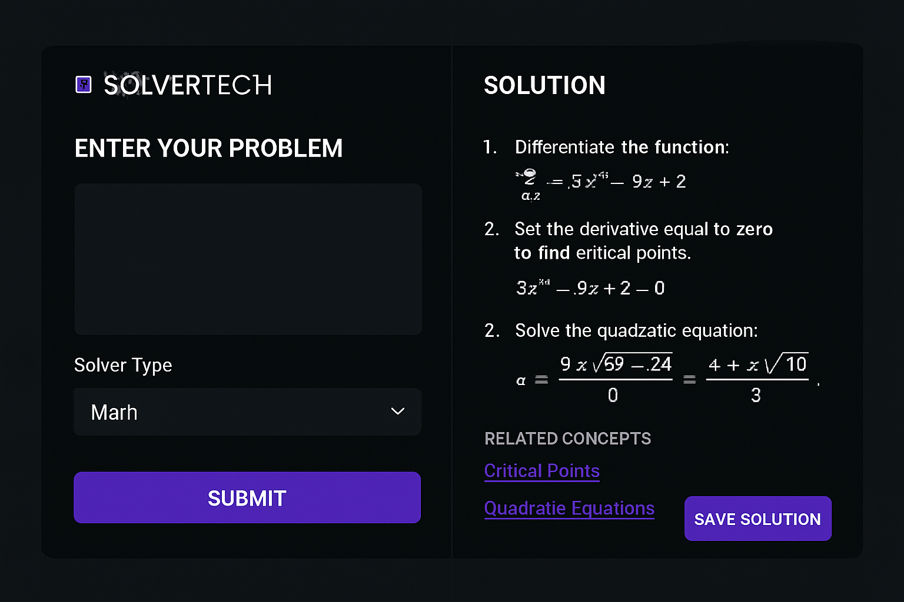

# SolverTech - Plataforma de Resolução de Problemas com IA


## Sobre o Projeto

**SolverTech** é uma plataforma revolucionária que utiliza inteligência artificial para resolver problemas complexos em tempo real. Desenvolvida para profissionais, pesquisadores, engenheiros e estudantes, oferece soluções otimizadas para desafios em matemática, engenharia, física, ciência de dados e muito mais.

## Características Principais

A plataforma SolverTech oferece um conjunto completo de recursos para resolver problemas de forma rápida e eficiente:

**Resolução Rápida e Precisa** - Obtenha respostas verificadas em segundos para problemas que normalmente levariam horas.

**Educação Interativa** - Explicações passo a passo que ajudam a compreender não apenas a resposta, mas o raciocínio por trás dela.

**Múltiplos Domínios** - Solvers especializados para matemática, engenharia, análise de dados e muito mais.

**Sistema de Gamificação** - Ganhe pontos, desbloqueie badges e suba no leaderboard enquanto aprende.

**Comunidade Colaborativa** - Compartilhe soluções, aprenda com outros usuários e contribua para a plataforma.

## Visualização do Projeto

### Homepage
A página inicial apresenta a proposta de valor com um design moderno e inspirador.


### Interface do Solver
Layout split otimizado para resolver problemas com entrada à esquerda e solução à direita.



## Stack Tecnológico

| Componente | Tecnologia | Descrição |
|---|---|---|
| Frontend | React 19 + Tailwind CSS 4 | Interface responsiva e intuitiva |
| Backend | Express.js 4 + Node.js | Servidor de alta performance |
| API | tRPC 11 | Type-safe RPC com type-safety end-to-end |
| Banco de Dados | MySQL/TiDB | Armazenamento escalável |
| ORM | Drizzle ORM | Query builder type-safe |
| Autenticação | Manus OAuth | Gerenciamento seguro de identidade |
| Armazenamento | AWS S3 | Armazenamento de documentos |
| IA | LLM Integration | Modelos de linguagem para explicações |

## Estrutura do Projeto

```
SolverTech/
├── client/                    # Aplicação frontend React
│   ├── src/
│   │   ├── pages/            # Componentes de páginas
│   │   │   ├── Home.tsx      # Landing page
│   │   │   ├── Solver.tsx    # Interface do solver
│   │   │   ├── Dashboard.tsx # Dashboard do usuário
│   │   │   └── History.tsx   # Histórico de soluções
│   │   ├── components/       # Componentes reutilizáveis
│   │   ├── contexts/         # React contexts
│   │   ├── hooks/            # Custom hooks
│   │   └── lib/              # Utilitários
│   └── public/               # Ativos estáticos
├── server/                    # Aplicação backend Express
│   ├── routers.ts            # Procedimentos tRPC
│   ├── db.ts                 # Helpers de banco de dados
│   ├── solvers/              # Módulos de resolução
│   │   ├── mathSolver.ts     # Solver matemático
│   │   ├── engineeringSolver.ts
│   │   └── dataSolver.ts
│   └── _core/                # Infraestrutura
├── drizzle/                   # Schema do banco de dados
├── shared/                    # Código compartilhado
├── DESIGN_GUIDE.md           # Guia de design visual
├── EXPLICACAO_PROJETO.md     # Documentação completa
└── todo.md                   # Rastreamento de features
```

## Paleta de Cores

A plataforma utiliza uma paleta de cores baseada em tons de roxo e azul, transmitindo criatividade e inovação.

| Cor | Código HEX | Uso |
|---|---|---|
| Roxo Escuro | `#4C1D95` | Backgrounds principais |
| Roxo Médio | `#7C3AED` | Botões e destaques |
| Roxo Claro | `#A78BFA` | Hover states |
| Azul Profundo | `#1E3A8A` | Backgrounds complementares |

Para mais detalhes sobre o design, consulte [DESIGN_GUIDE.md](./DESIGN_GUIDE.md).

## Solvers Disponíveis

### Math Solver
Resolve equações algébricas, cálculo, álgebra linear, probabilidade e estatística com explicações passo a passo.

### Engineering Solver
Aborda problemas de mecânica, termodinâmica, circuitos elétricos, estruturas e dinâmica de fluidos.

### Data Solver
Realiza análise estatística, regressão, clustering, processamento de séries temporais e visualização.

## Sistema de Gamificação

**Pontos por Resolução** - Ganhe pontos ao resolver problemas, com bônus por dificuldade.

**Badges de Conquista** - Desbloqueie badges especiais ao atingir marcos.

**Leaderboard** - Suba no ranking global e compare seu desempenho com outros usuários.

**Streaks** - Mantenha uma sequência de dias resolvendo problemas para ganhos bônus.

## Guia de Início Rápido

### Pré-requisitos

- Node.js 18+
- pnpm ou npm
- Banco de dados MySQL/TiDB

### Instalação

```bash
# Clonar o repositório
git clone https://github.com/EmersonXPro/SolverTech.git
cd SolverTech

# Instalar dependências
pnpm install

# Configurar variáveis de ambiente
cp .env.example .env.local

# Executar migrações do banco de dados
pnpm db:push

# Iniciar servidor de desenvolvimento
pnpm dev
```

O servidor estará disponível em `http://localhost:3000`.

## Desenvolvimento

### Fluxo de Desenvolvimento

1. **Atualizar Schema** - Modifique `drizzle/schema.ts` e execute `pnpm db:push`
2. **Implementar Solvers** - Crie novos módulos em `server/solvers/`
3. **Criar Procedimentos** - Defina novos procedimentos em `server/routers.ts`
4. **Desenvolver Frontend** - Implemente UI em `client/src/pages/`

### Comandos Úteis

```bash
# Desenvolvimento
pnpm dev              # Inicia servidor de desenvolvimento

# Banco de dados
pnpm db:push         # Aplica migrações
pnpm db:studio       # Abre Drizzle Studio

# Build
pnpm build           # Compila para produção

# Testes
pnpm test            # Executa testes
pnpm test:watch      # Modo watch
```

## Documentação

- [EXPLICACAO_PROJETO.md](./EXPLICACAO_PROJETO.md) - Documentação técnica completa
- [DESIGN_GUIDE.md](./DESIGN_GUIDE.md) - Guia de design visual
- [tRPC Documentation](https://trpc.io/docs)
- [Tailwind CSS](https://tailwindcss.com/docs)
- [Drizzle ORM](https://orm.drizzle.team/docs/overview)

## Recursos Principais

### Dashboard Personalizado
Cada usuário tem acesso a um dashboard mostrando histórico, estatísticas e recomendações personalizadas.

### Explicações Detalhadas
Cada solução inclui resumo executivo, passo a passo, conceitos relacionados e aplicações práticas.

### Integração com LLM
Modelos de linguagem avançados para gerar explicações naturais e validar soluções.

### API Pública
Integre SolverTech com seus sistemas através de uma API robusta e bem documentada.

## Casos de Uso

**Educação** - Estudantes usam para verificar respostas, aprender novos conceitos e preparar-se para exames.

**Pesquisa** - Pesquisadores utilizam para análise de dados complexa e validação de cálculos.

**Engenharia** - Engenheiros resolvem problemas de design e validam cálculos estruturais.

**Ciência de Dados** - Data scientists exploram datasets e testam hipóteses rapidamente.

**Consultoria** - Consultores usam para gerar análises rápidas para clientes.

## Contribuindo

As contribuições são bem-vindas! Por favor:

1. Faça um fork do projeto
2. Crie uma branch para sua feature (`git checkout -b feature/AmazingFeature`)
3. Commit suas mudanças (`git commit -m 'Add some AmazingFeature'`)
4. Push para a branch (`git push origin feature/AmazingFeature`)
5. Abra um Pull Request

## Licença

Este projeto está licenciado sob a MIT License - veja o arquivo LICENSE para detalhes.

## Contato

Para dúvidas ou sugestões, entre em contato através de:

- Email: contato@solvertech.io
- GitHub: [EmersonXPro](https://github.com/EmersonXPro)
- Website: [solvertech.io](https://solvertech.io)

## Agradecimentos

Desenvolvido com ❤️ por [Emerson Xavier](https://github.com/EmersonXPro) usando Manus AI.

---

**Última atualização:** Novembro 2025
